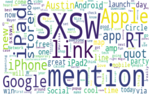
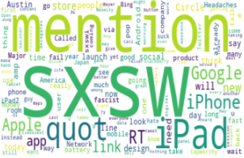
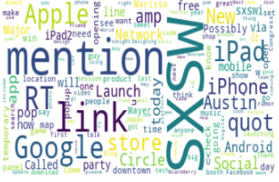
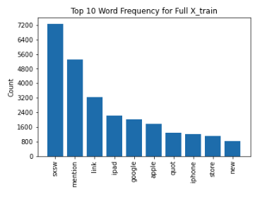

# Twitter Sentiment Analysis for South By Southwest

## Project Overview

This project uses tweets which have been assigned an emotion to build a machine learning model that can be utilized as a tool by Target to understand which products they show showcase or put on sale during the upcoming holiday season.

## Business Problem

South By Southwest (SXSW) is one of the largest festivals in the world.  Taking place in Austin, Texas it consists of many exhibitions.  Technology based companies attend the event to showcase their brand any new technologies.

Google and Apple attend South By Southwest.  The conference is looking to see how they can utilize twitter data to build a model for these companies to utilize in seeing if a tweet about their company/product is positive, neutral or negative.

By building a model that can use twitter data from one of the worlds largest technology conferences they will better understand what is looked upon positively and what is looked upon negatively from potential buyers in the future.

## The Data

The dataset comes from CrowdFlower via data.world. Human Raters rated the sentiment in over 9,000 Tweets as positive, negative, or neither (neutral). The dataset shows that this twitter set was most likely pulled from those who were attending the SXSW conference due to the amount of mentions in the tweets.

## Word Cloud of Emotion Behind Tweet

### Positive Word Cloud

### Negative Word Cloud

### Neutral Word Cloud

## NLP

Natural Langauge Processing was utilized to clean the twitter data.  This process included:
* Standardizing
* Tokeninzing

After cleaning the text data, you could look at frequency of words in the full dataset:

### Word Frequency

## Modeling Process

Three different models were created before choosing the best fit model.  Before modeling was done, the data was vectorized using TF-IDF Vecotrizer.

### Model Types:
* Baseline Model with Multinomial NB
* Random Forest
* XGBoost

## Conclusion

The best fit model was Random Forest.  This model has an accuracy of 0.67.  Neutral was the best predicted emotion due to it having the most tweets.  Precision scores are good throughout all classes in the model.

It is worth noting that there is a huge class imbalance which is causing poor results for class 0 which is tweets associated as negative.

It is reccomended to utilize this model to predict the emotion behind specific products which will be sold at Target.  It is also recommended to utilize this model with more data to increase the scores especially in class 0.