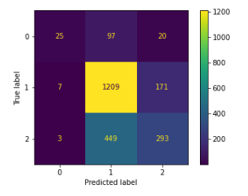
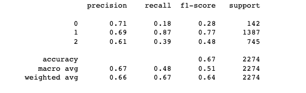

# Twitter Sentiment Analysis for South By Southwest

## Project Overview

This project uses tweets which have been assigned an emotion to build a machine learning model that can be utilized as a tool by the South By Southwest conference.

## Business Problem

South By Southwest (SXSW) is one of the largest festivals in the world.  Taking place in Austin, Texas it consists of many exhibitions.  Technology based companies attend the event to showcase their brand any new technologies.

Google and Apple attend South By Southwest.  The conference is looking to see how they can utilize twitter data to build a model for these companies to utilize in seeing if a tweet about their company/product is positive, neutral or negative.

By building a model that can use twitter data from one of the worlds largest technology conferences they will better understand what is looked upon positively and what is looked upon negatively from potential buyers in the future.

## The Data

The dataset comes from CrowdFlower via data.world.  

Human Raters rated the sentiment in over 9,000 Tweets as positive, negative, or neither (neutral).  There was large class imblanace with the dataset:
* Neutral Tweets: 5,545
* Positive Tweets: 2,978
* Negative Tweets: 570

The dataset shows that this twitter set was most likely pulled from those who were attending the SXSW conference due to the amount of mentions in the tweets.

## Word Cloud of Emotion Behind Tweet

### Positive Word Cloud

### Negative Word Cloud

### Neutral Word Cloud

## NLP

Natural Langauge Processing was utilized to clean the twitter data.  This process included:
* Standardizing
* Tokeninzing

After cleaning the text data, you could look at frequency of words in the full dataset:

### Word Frequency

## Modeling Process

Three different models were created before choosing the best fit model.  Before modeling was done, the data was vectorized using TF-IDF Vecotrizer.

### Model Types:
* Baseline Model with Multinomial NB
* Random Forest
* XGBoost

## Final Model

The best performing model was Random Forest with default parameters.

### Confusion Matrix

A confusion matrix was utilized to showcase largest area of mislabeled tweets.

### Classification Report

A classification report was run on the best model.  This model has an accuracy of 67%.

## Conclusion

The best fit model was built with Random Forest. This model will accurately predict the emotion of a tweet 67% of the time. 

There was a huge class imbalance causing Class 0 (negative emotion) to perform poorly.  Class 1 (neutral emotion) performed the best in the final model.

It is recommended to utilize this in showcasing another way in which companies can benefit from the South By Southwest conference.  Specifically technology based companies.

It is also recommended to utilize this model with more data to increase the scores.
